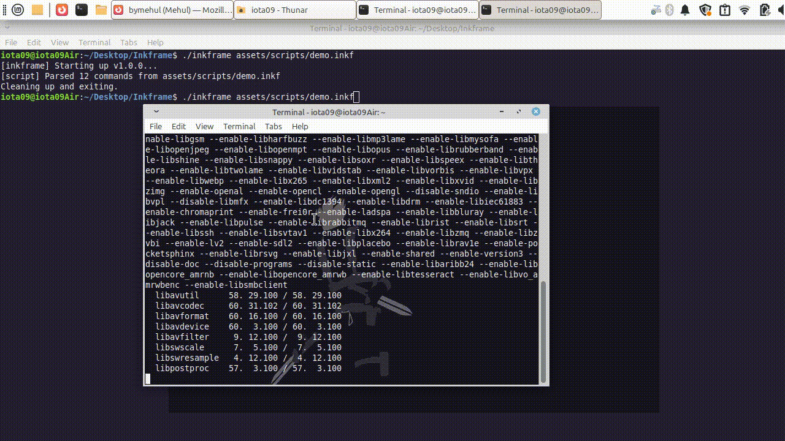

# Vnefall

Vnefall is a simple, no-nonsense visual novel engine. It's built in Odin using SDL2 and OpenGL 3.3.



## How to get started

### Just want to run it? (Linux)
If you're on Linux, just grab the `vnefall-linux-x64` binary from the [Releases](https://github.com/bymehul/vnefall/releases) page. Run it like this:
```bash
chmod +x vnefall-linux-x64
./vnefall-linux-x64 assets/scripts/demo.vnef
```

### Want to build from source?
*(Note: Windows and Mac versions are currently untested).*

You'll need the [Odin Compiler](https://odin-lang.org/) and SDL2 libraries.

**Linux (Ubuntu/Debian):**
```bash
sudo apt install libsdl2-dev libsdl2-mixer-dev
./build.sh
./vnefall assets/scripts/demo.vnef
```

**Windows:**
Install Odin, download the SDL2 development libs, and run:
```powershell
odin build src -out:vnefall.exe
./vnefall.exe assets/scripts/demo.vnef
```

**Mac:**
```bash
brew install sdl2 sdl2_mixer
odin build src -out:vnefall
./vnefall assets/scripts/demo.vnef
```

## Writing your own story

Scripts are just simple text files ending in `.vnef`. You can change backgrounds, play music, and write dialogue without touching a single line of code.

See the [detailed command guide](docs/commands/) for all available commands.

Here's what a script looks like:
```bash
title "A Human Story"
bg room.png
music bgm.mp3

say Alice "I can't believe it's actually working."
say Narrator "She smiled at the screen."

wait
end
```

## Controls
- **Click / Space / Enter**: Next line.
- **Escape**: Quit.

## Contributing
Check out [CONTRIBUTING.md](CONTRIBUTING.md) for the guide. We like clean, readable code with simple logic.

## License
This project is licensed under the [MIT License](LICENSE). 

I am also planning to transition to a **dual-licensing** model in the future to support long-term development.
